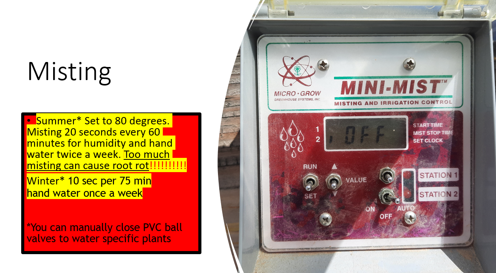
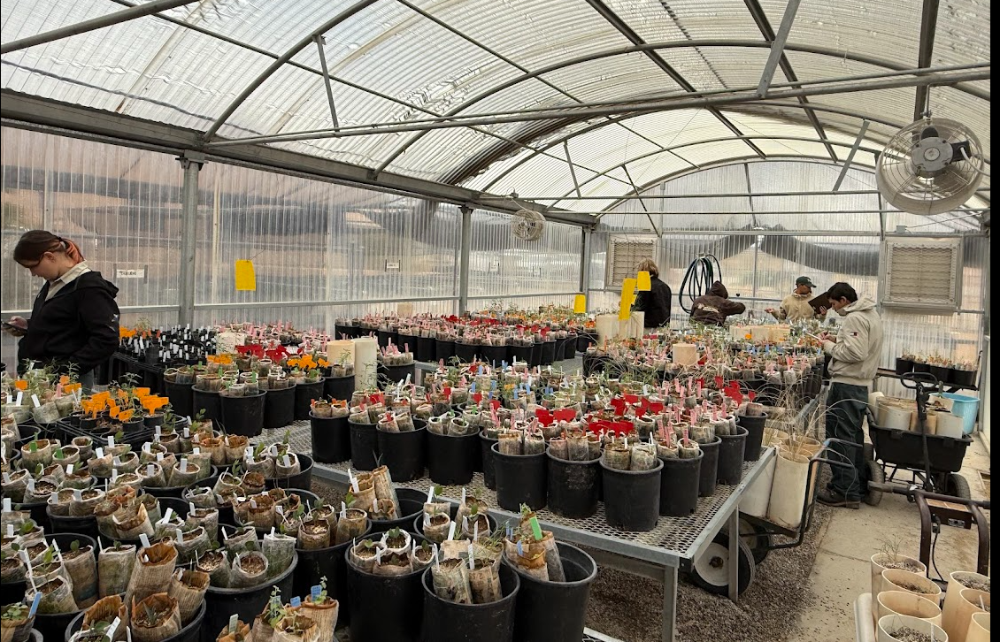
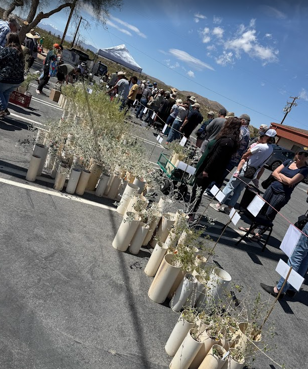

# Joshua Tree National Park — Nursery Operations & Botanical Field Systems

## Nursery Operations

Over three years, I led day-to-day operations of a native plant nursery at Joshua Tree National Park within a shared management structure, operating with a high degree of independence and technical responsibility.

I planned and executed a propagation quota of approximately **6,000 plants over 18 months** across **20+ native species**, matched to specific restoration projects. In addition, I propagated and sold ~600 plants during the annual plant sale, generating over **$6,000** in revenue.

The work required coordinating biological systems (species ecology), mechanical systems (irrigation and cooling infrastructure), and human systems (volunteers, crews, reporting, and compliance).

---

## Infrastructure & Environmental Controls

I installed and repaired critical infrastructure supporting greenhouse stability and plant survival.

- Installed a ~$7,000 wet wall evaporative cooling system, including plumbing and foundation preparation for a 20’ x 10’ cooling wall to ensure level drainage.
- Replaced greenhouse support columns using sleeve reinforcement.
- Reroofed the tool shed, sourcing materials and replacing degraded structural elements.
- Built a sediment capture basin to prevent runoff intrusion into the nursery and buried ground cloth to suppress weeds.

---

## Irrigation Systems & Risk Management

The nursery relied on dripline irrigation, misting systems, and seasonal flow adjustments. I documented valve locations, controller numbers, and seasonal schedules to prevent system failure during extreme desert heat.

Species such as Joshua Trees are highly susceptible to root rot; misting intervals and flow control were calibrated accordingly to avoid overwatering.

---

## Propagation & Volunteer Leadership

Propagation moved through multiple greenhouse stages before transition to outdoor dripline systems. I supervised:

- 7 weekly volunteers  
- Groups of up to 40 volunteers  
- Conservation corps crews during multi-week hitches  

Responsibilities included task allocation, safety oversight, workflow organization, and plant stage assessment.

---

## Plant Sale & Public Engagement

I organized and supported the annual native plant sale, coordinating inventory, layout, and public engagement.

I also taught a four-week wildcrafting course and presented on nursery systems and restoration workflows.

During park events, I engaged with regional leadership and partners.

---

## Botanical Fieldwork & Data QA/QC

In addition to nursery operations, I conducted three years of botanical fieldwork and herbarium work, including one full season of primary data collection alongside another botanist.

This work involved:

- Field identification using **dichotomous keys**
- Morphological verification and specimen preparation
- Species list development and habitat documentation

I organized, standardized, and quality-assured approximately **100,000 rows of botanical field data**, including:

- Species name standardization and synonym resolution  
- Coordinate verification and formatting correction  
- Cross-checking entries against field notes  
- Data cleaning for research submission  

The finalized dataset was delivered directly to research collaborators for ecological analysis.

This work required taxonomic precision, structured data management, and disciplined QA/QC practices, bridging field ecology and long-term data integrity.

---

**Zhuba Goldenlamb**  
Environmental Systems • Botanical Fieldwork • Infrastructure Operations • GIS Integration  
https://github.com/ZhubaGoldenlamb
